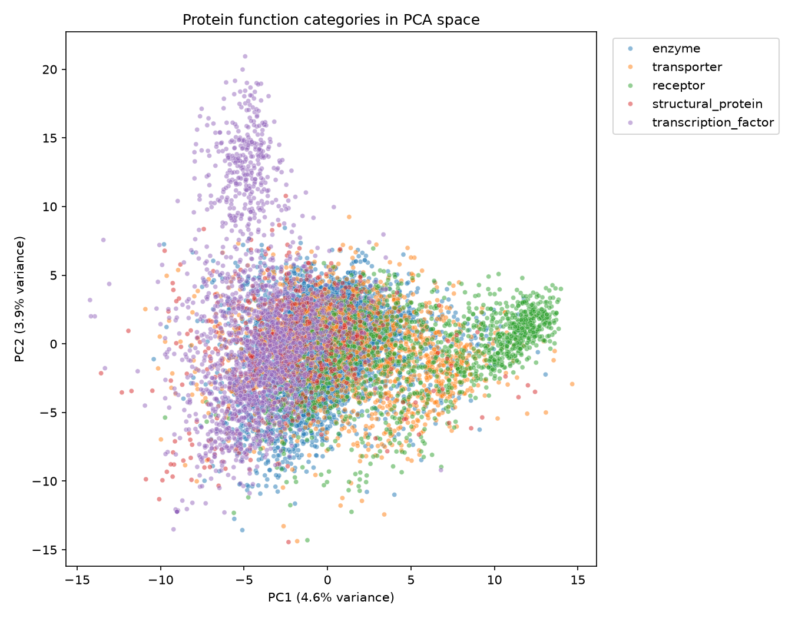
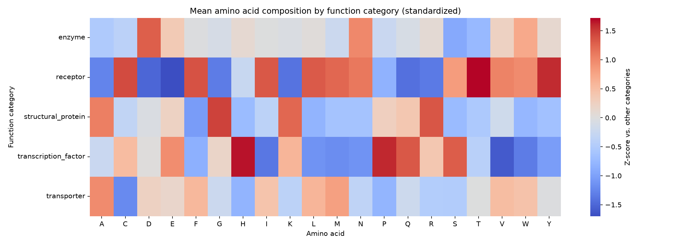
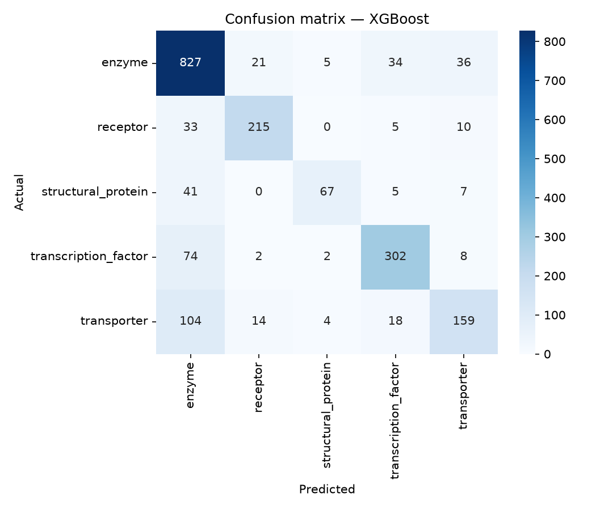
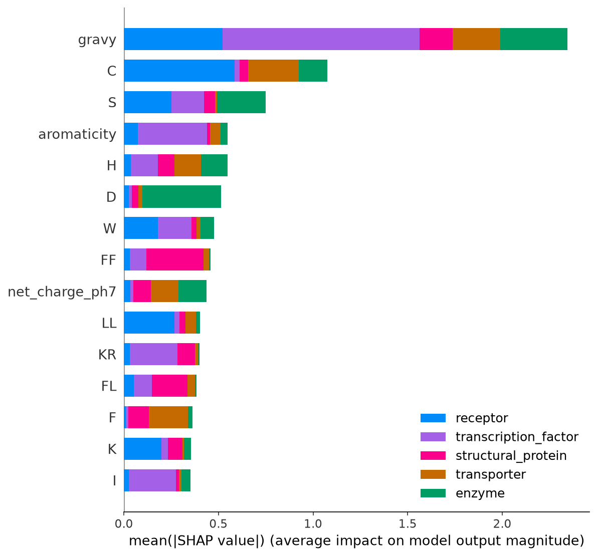
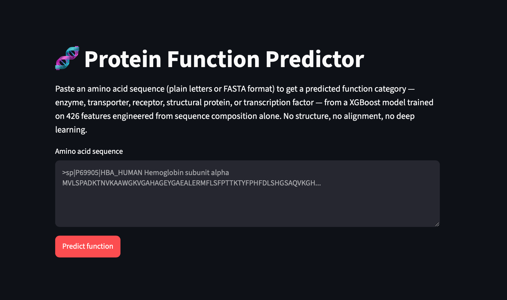

# 🧬 Protein Function Prediction from Amino Acid Sequence

Predicting a protein's function category — **enzyme, transporter, receptor, structural protein, or transcription factor** — directly from its amino acid sequence, using classical machine learning. No deep learning, no GPU, no 3D structure or alignment — just features engineered from sequence composition alone.

Self-taught bioinformatics portfolio project.

## The question

Three questions motivated this project:
- Can you predict what a protein does just from its amino acid sequence composition?
- Do enzymes have a different amino acid fingerprint than receptors or transporters?
- Which physicochemical properties matter most for function — charge, hydrophobicity, size?

Short answer: **partially yes**, and not always in the way the textbook hypothesis predicted — see [Interpretability](#interpretability) below.

## Results at a glance

| | |
|---|---|
| Dataset | 9,961 labeled human proteins (UniProt, Swiss-Prot reviewed only) |
| Features | 426 (20 amino acid composition + 400 dipeptide composition + 6 physicochemical) |
| Best model | XGBoost |
| Test accuracy | 78.8% |
| Test macro F1 | 75.1% *(headline metric — see [Evaluation](#evaluation) for why)* |

<!-- FILL IN: paste the Cell 8 results_df table (Logistic Regression / Random Forest / XGBoost, accuracy / macro F1 / weighted F1) here -->

## Data

Sourced from [UniProt](https://www.uniprot.org/) via its REST API, restricted to:
- **Reviewed entries only** (Swiss-Prot) — manually curated against the literature, not computationally predicted
- **Human proteins** (`organism_id:9606`) — keeps this v1 dataset a manageable, single-species scope
- **50–2000 residues, complete sequences** — excludes fragments and extreme outliers

Each function category maps to a specific UniProt controlled-vocabulary term:

| Category | Term |
|---|---|
| Enzyme | GO:0003824 (catalytic activity) |
| Transporter | Keyword KW-0813 (Transport) |
| Receptor | Keyword KW-0675 (Receptor) |
| Structural protein | GO:0005198 (structural molecule activity) — UniProt has no dedicated "Structural protein" keyword |
| Transcription factor | Keyword KW-0805 (Transcription regulation) |

Proteins matching more than one category (e.g. a receptor tyrosine kinase is genuinely both a receptor and an enzyme) were dropped, keeping this a clean single-label classification problem — a deliberate v1 simplification, not an oversight.

Final class distribution:

| Category | Count |
|---|---|
| Enzyme | 4,614 |
| Transcription factor | 1,938 |
| Transporter | 1,494 |
| Receptor | 1,316 |
| Structural protein | 599 |

A ~7.7:1 imbalance between the largest and smallest class — this shaped both the evaluation metric and the model's error pattern (see below).

## Features

Three feature groups, 426 numbers per protein:

- **Amino acid composition** (20 features) — fraction of the sequence each of the 20 standard amino acids makes up
- **Dipeptide composition** (400 features) — fraction of every adjacent amino-acid pair, capturing a little local sequence order
- **Physicochemical properties** (6 features) — sequence length, molecular weight, hydrophobicity (GRAVY / Kyte-Doolittle), net charge at pH 7, isoelectric point, aromaticity

Computed with [Biopython](https://biopython.org/)'s `ProteinAnalysis` and a hand-written dipeptide counter — see `src/features.py`.

## Exploratory analysis

PCA on the standardized 426-feature space shows partial separation — receptor and transcription_factor form the most visually distinct clusters; enzyme, transporter, and structural_protein overlap heavily in the center. This tracks with the composition heatmap below: categories with the most extreme amino-acid signatures separate best in 2D.

| Category | Signature |
|---|---|
| Enzyme | Flattest row — near-average composition; function lives in a small active site, not the whole sequence |
| Receptor | Strongly hydrophobic/aromatic, elevated cysteine |
| Transporter | Mildly hydrophobic, cysteine-depleted (opposite of receptor) |
| Structural protein | Strong glycine enrichment |
| Transcription factor | Strong histidine + moderate proline enrichment (not lysine, as originally hypothesized) |

## Modeling

Three models compared on a stratified 80/20 train/test split (features standardized for logistic regression; unnecessary for the two tree-based models):

<!-- FILL IN: paste the Cell 10 5-fold cross-validation mean +/- std for all three models here -->

XGBoost won on macro F1 and was carried forward to interpretability and the app.

## Evaluation

Accuracy alone is misleading here — a model could hit ~46% just by always guessing "enzyme," since enzyme is 46% of the dataset. **Macro F1 (75.1%)** weighs all five classes equally regardless of size, which is why it's the headline number, not the 78.8% accuracy.

| Category | Precision | Recall | F1 |
|---|---|---|---|
| Enzyme | 76.6% | 89.6% | 82.6% |
| Receptor | 85.3% | 81.7% | 83.5% |
| Structural protein | 85.9% | 55.8% | 67.7% |
| Transcription factor | 83.0% | 77.8% | 80.3% |
| Transporter | 72.3% | 53.2% | 61.3% |

Enzyme is the most common wrong answer for every other class — a "gravitational sink" effect. Its flat, near-average amino-acid signature means any protein without a strong fingerprint of its own tends to fall toward it by default.

## Interpretability

SHAP values (`shap.TreeExplainer`) on the trained XGBoost model, computed per-class on the held-out test set.

| Category | Hypothesized (pre-data) | Heatmap showed | SHAP found most predictive |
|---|---|---|---|
| Transcription factor | Lysine/arginine-rich | Histidine/proline enrichment | Low hydrophobicity (`gravy`) by a wide margin, then the `KR` dipeptide — confirming Lys-Arg as a *pair*, not raw content |
| Receptor | Mixed hydrophobic core / polar surface | Strongly hydrophobic + aromatic | **Cysteine** — ranked ahead of hydrophobicity itself |
| Structural protein | Glycine/proline-rich | Glycine strongly confirmed | **`FF` (phenylalanine pair) dipeptide** — glycine doesn't crack the top 15 |
| Transporter | High hydrophobic content | Mild hydrophobic warmth, cysteine-depleted | Cysteine (same top feature as receptor, opposite direction) |
| Enzyme | Active-site residues, near-average bulk | Flattest row | Aspartate — a real signal despite the flat overall profile |

The clearest surprise: structural protein's most eye-catching *univariate* signal (glycine) carries almost no weight in the *trained model* — an aromatic dipeptide pattern does instead. A reminder that a heatmap and a multivariate model can genuinely disagree, and both are worth checking.

## Try it

A Streamlit app (`app/app.py`) takes a pasted sequence (plain text or FASTA) and returns a predicted category with per-class probabilities:

\`\`\`bash
conda env create -f environment.yml
conda activate proteinfunc
streamlit run app/app.py
\`\`\`

## Limitations

- **Human proteins only** — a deliberate v1 scope decision; cross-species generalization untested
- **Single-label simplification** — proteins genuinely belonging to more than one category were dropped rather than modeled as multi-label
- **Class imbalance** — structural_protein (599 examples) is under-represented relative to enzyme (4,614); its lower recall (55.8%) partly reflects this
- **No sequence order beyond adjacent pairs** — dipeptide composition captures local order, not motifs, domains, or 3D structure

## What this offers

- Expand beyond human-only to test cross-species generalization
- Try true multi-label classification instead of dropping overlapping proteins
- Compare against a structure-aware or embedding-based approach (e.g. ESM) as an upper bound

## Repository structure

\`\`\`
protein-function-ml/
├── data/
│   ├── raw/              # UniProt downloads (not tracked in git)
│   └── processed/         # Labeled dataset + engineered features (not tracked in git)
├── notebooks/
│   ├── 01_eda_pca_heatmap.ipynb
│   ├── 02_model_comparison.ipynb
│   └── 03_interpretability.ipynb
├── src/
│   ├── features.py         # Feature engineering functions
│   ├── build_dataset.py    # UniProt data combination + labeling
│   └── build_features.py   # Applies features.py across the dataset
├── models/                 # Trained model artifact (not tracked in git)
├── app/
│   └── app.py              # Streamlit app
├── results/figures/        # All generated plots
├── environment.yml
└── README.md
\`\`\`

## Setup

\`\`\`bash
git clone git@github.com:reuel-web/protein-function-ml.git
cd protein-function-ml
conda env create -f environment.yml
conda activate proteinfunc
\`\`\`

Data isn't included in the repo (regenerable, and UniProt's terms don't favor redistributing bulk downloads) — rerun \`src/build_dataset.py\` and \`src/build_features.py\` after downloading fresh data from UniProt (see the Data section above for the exact queries used).

## Tech stack

Python · pandas · scikit-learn · XGBoost · Biopython · SHAP · Streamlit · UniProt REST API
